# 要件定義フロー & ボトルネック分析

## フロー図（DFD風）

```mermaid
flowchart TD
    START([開始]) --> P0

    subgraph P0["🔴 フェーズ0：情報収集（ボトルネック①）"]
        direction TB
        U0[/"ユーザーから6項目の情報収集\n・プロジェクト名\n・概要\n・オーナー/スポンサー\n・ステークホルダー\n・期間・予算\n・制約条件"/]
    end

    P0 -->|情報が揃わないと一切進めない| P1

    subgraph P1["フェーズ1：基盤文書作成"]
        direction TB
        S1["Step1\nビジネスケース\n（背景・課題・期待便益）"]
        C1{{"✋ ユーザー確認"}}
        S2["Step2\nプロジェクト憲章\n（スコープ・目標の公式宣言）"]
        C2{{"✋ ユーザー確認"}}
        S1 --> C1 --> S2 --> C2
    end

    P1 -->|🔴 ボトルネック②\n憲章が全フェーズ2のゲート| P2

    subgraph P2["フェーズ2：計画文書作成"]
        direction TB
        S3["Step3\nステークホルダー登録簿\n（誰から収集するか）"]
        C3{{"✋ ユーザー確認"}}
        S4["Step4\n要件マネジメント計画書\n（どう収集・管理するか）"]
        C4{{"✋ ユーザー確認"}}
        S3 --> C3 --> S4 --> C4
    end

    P2 --> P3

    subgraph P3["フェーズ3：要件定義実行"]
        direction TB
        S5["Step5\n前提・制約条件ログ\n（要件の根拠を明文化）"]
        C5{{"✋ ユーザー確認"}}
        S6["Step6\n要件文書\n（機能・非機能要件を網羅）"]
        C6{{"✋ ユーザー確認"}}
        S7["Step7\nスコープ記述書\n（スコープ境界の確定）"]
        C7{{"✋ ユーザー確認"}}
        S8["Step8\nトレーサビリティマトリクス\n（要件×目的×テストの紐付け）"]
        C8{{"✋ ユーザー確認"}}
        S5 --> C5 --> S6 --> C6
        C6 --> S7 --> C7
        C6 --> S8
        C7 --> S8
        S8 --> C8
    end

    P3 -->|🔴 ボトルネック③\nStep6+7が両方揃わないとStep8に進めない| P4

    subgraph P4["フェーズ4：完了後成果物"]
        direction TB
        S9["Step9\nWBS\n（要件→作業・成果物への落とし込み）"]
    end

    P4 --> END([完了])

    %% スタイル定義
    classDef bottleneck fill:#ff6b6b,stroke:#c0392b,color:#fff,font-weight:bold
    classDef confirm fill:#f39c12,stroke:#e67e22,color:#fff
    classDef normal fill:#3498db,stroke:#2980b9,color:#fff
    classDef phase fill:#ecf0f1,stroke:#bdc3c7

    class U0 bottleneck
    class C1,C2,C3,C4,C5,C6,C7,C8 confirm
    class S1,S2,S3,S4,S5,S6,S7,S8,S9 normal
```



---

## ボトルネック一覧

| # | 場所 | なぜボトルネックになるか | 影響 |
|---|------|------------------------|------|
| ① | フェーズ0（情報収集） | ユーザーからの6項目がすべての起点。1つでも不明だと後続が全止まり | **全ステップが待機状態** |
| ② | Step2（プロジェクト憲章） | フェーズ1の唯一の出口。フェーズ2以降の全作業がここにゲートされる | **フェーズ2〜4の全停止** |
| ③ | Step6+7 → Step8 | RTMはStep6（要件文書）とStep7（スコープ記述書）の**両方**が完成してから作成可能 | **Step8・Step9の待機** |

---

## ユーザー確認によるレイテンシ

各ステップ後に必ずユーザー確認が入るため、**確認待ち時間が最大のリードタイム要因**になる可能性がある。

```
全9ステップ × 確認待ち = 最大9回の待機が発生
```

確認をまとめて行う（フェーズ単位でまとめてレビュー）などの工夫でスループット改善が見込める。
